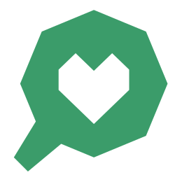

# NutriLens (Cliente)

Cliente para el proyecto NutriLens

## Requisitos

Antes debemos instalar los requisitos para este proyecto:

- [git](https://git-scm.com/)
- [Bun](https://bun.sh/) o [Node.js v22+](https://nodejs.org/en)

## Cómo correr este proyecto

Primero clonamos este repositorio y accedemos al directorio con los comandos:

> git clone https://github.com/Vienna-Code/nutrilens-client
> 
> cd nutrilens-client

Dependiendo de nuestro runtime a utilizar los comandos serán diferentes, por lo que debe referirse al que corresponda para ejecutar los comandos siguientes.

  
Bun

  Instalamos las dependencias con

  > bun install

  Luego de haber instalado las dependencias podemos:

  - Correr el proyecto en modo desarrollo
  
    > bun dev
  
  - Correr el proyecto en modo producción

    > bun run build
    >
    > bun run preview

 

  
Node

  Instalamos las dependencias con

  > npm install

  Luego de haber instalado las dependencias podemos:

  - Correr el proyecto en modo desarrollo
  
    > npm run dev
  
  - Correr el proyecto en modo producción

    > npm run build
    >
    > npm run preview

